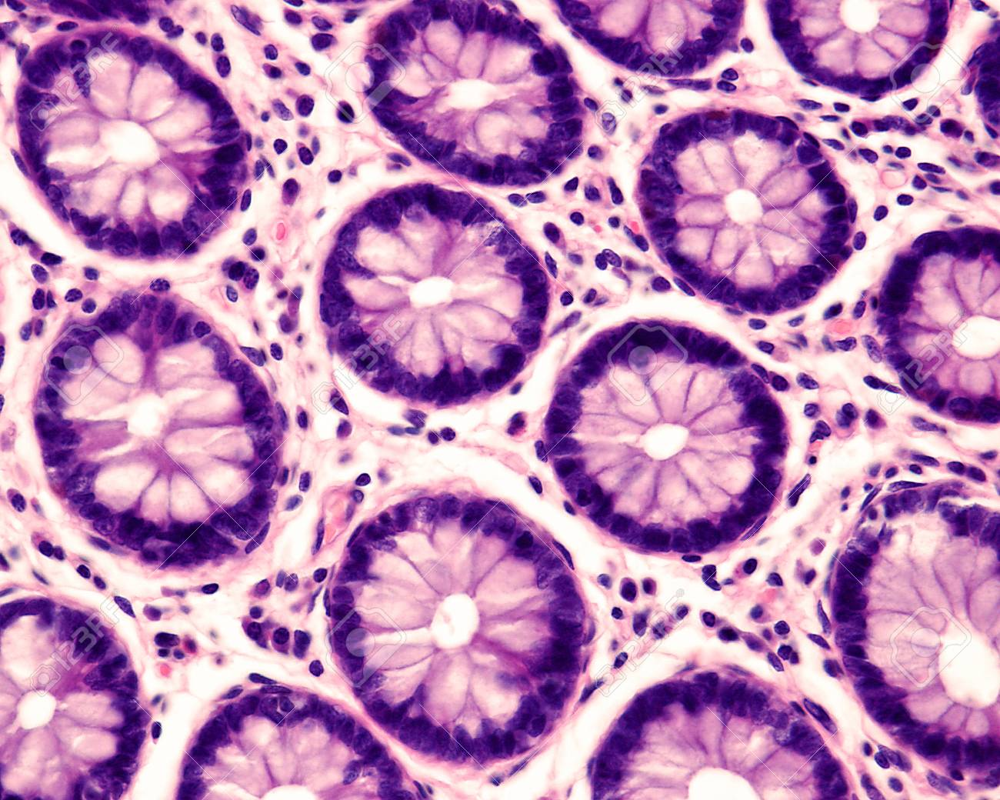

# Introduction 

We thought we could look at the size distribution of partials to get an idea about potential contributions of TA cells to stem cell clones. eg to test the **N + 1 hypothesis** [^1]  

[^1]: Which we have never tested before

## Scoring partials {#ID1}

To look at partials we need to score them. We do this in eights. Here are some example pictures of this.

However, this is not an intestinal crypt

## the data {#ID3}

We scored a number of partials for different marks

| mark | clones scored |
|------|---------------|
| MAOA | 169           |
| HDAC6| 145           |
| STAG2| 198           |

For a sample image of the various marks click here:  
1.[MAOA](#ID1)  
2.[STAG2](#ID2)
3.[HDAC6](#ID3)

# the lab {#ID2}

if you want to find out more about who we are go to:  
[https://www.cruk.cam.ac.uk/research-groups/winton-group]

For more information about simple R Markdown websites, please read the documentation at https://bookdown.org/yihui/rmarkdown/rmarkdown-site.html.

Please also note that simple R Markdown sites are _not_ based on **blogdown**. They are probably good for websites with only a few Rmd documents. For larger-scale and more sophisticated websites (such as blogs), you may want to use **blogdown** instead: https://github.com/rstudio/blogdown.
